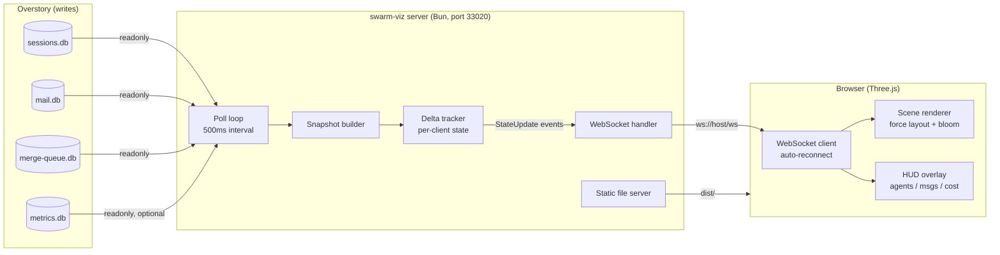
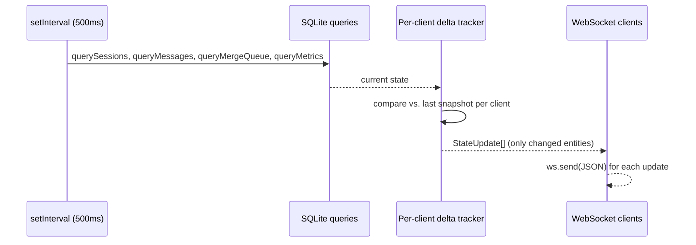
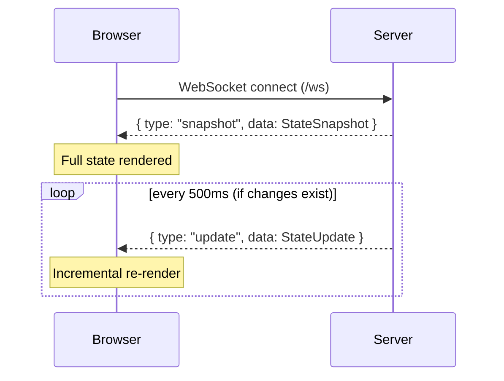
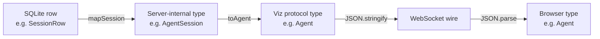
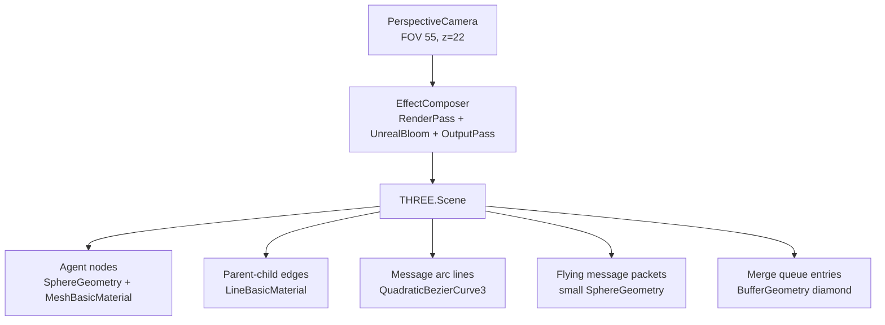

# swarm-viz Architecture

swarm-viz is a real-time WebGL dashboard that visualizes the state of an [Overstory](https://github.com/jayminwest/overstory) multi-agent swarm. This document covers the full data flow from Overstory's SQLite databases through the WebSocket protocol to the Three.js renderer.

---

## System Overview



---

## Data Flow Detail

### 1. Overstory State Databases

Overstory writes to four SQLite databases under its `.overstory/` directory:

| Database | Key Tables | swarm-viz Use |
|----------|-----------|---------------|
| `sessions.db` | `sessions` | Agent name, state, depth, parent, last activity |
| `mail.db` | `messages` | Inter-agent mail: from/to, type, priority, timestamp |
| `merge-queue.db` | `merge_queue` | Branch merge status, files modified |
| `metrics.db` | `sessions` | Token counts, cost, model per session |

All databases are opened with `readonly: true`. swarm-viz never writes to Overstory state.

WAL mode (enabled by default in Bun SQLite) allows concurrent reads while Overstory writes.

### 2. Server Poll Loop



On each tick the server:

1. Queries all four databases
2. For each connected client, computes deltas against that client's last-seen state
3. Emits only changed entities as `StateUpdate` events (agent\_update, message\_event, merge\_update, metrics\_update)

This keeps WebSocket traffic minimal even with many agents.

### 3. WebSocket Protocol



**StateSnapshot** (sent once on connect):

```typescript
{
  agents:     Agent[]            // all active agent sessions
  messages:   AgentMessage[]     // last 50 messages
  mergeQueue: MergeQueueEntry[]  // full merge queue
  metrics:    SwarmMetrics       // aggregated counts + cost
}
```

**StateUpdate** (sent per-change):

```typescript
{ type: "agent_update",   data: Agent }
{ type: "message_event",  data: AgentMessage }
{ type: "merge_update",   data: MergeQueueEntry }
{ type: "metrics_update", data: SwarmMetrics }
```

The client never sends data to the server. The connection is read-only by design.

### 4. Type Mapping Pipeline



Types pass through three layers:

- **DB row types** (`SessionRow`, `MessageRow`, etc.) — raw SQLite column names, defined in `server/mappers.ts`
- **Server-internal types** (`AgentSession`, `MailMessage`, `DbMergeQueueEntry`) — camelCase, full fidelity, never sent to client
- **Viz protocol types** (`Agent`, `AgentMessage`, `MergeQueueEntry`) — minimal, browser-safe, what travels over WebSocket

The `Db` prefix on internal merge entries (`DbMergeQueueEntry`) avoids name collisions with the viz protocol type (`MergeQueueEntry`).

---

## Client Architecture

### Scene Graph



### Force-Directed Layout

Agent nodes use a simple spring-repulsion simulation running entirely in JavaScript on each animation frame:

- **Repulsion**: all pairs of nodes push apart (inverse square)
- **Attraction**: parent-child pairs have a spring pulling them together
- **Centering**: mild force pulling all nodes toward origin
- **Damping**: velocity decays each frame to prevent oscillation

The simulation runs in 2D (x/y plane); z is fixed at 0. This keeps the layout readable while matching the front-facing camera perspective.

### Animation States

Each agent node has two animation timers:

| Timer | Direction | Duration | Trigger |
|-------|-----------|----------|---------|
| `spawnT` | 0 → 1 | 0.5s | Node created |
| `fadeT` | 0 → 1 | 2.0s | Agent state = `completed` |

During spawn, node scale is interpolated from 0 to 1. During fade, opacity goes from 1 to 0. After the fade completes the node is removed from the scene.

Working agents pulse — their scale oscillates sinusoidally with a unique per-node phase offset so they don't pulse in unison.

### Message Arcs

When a `message_event` arrives:

1. A `QuadraticBezierCurve3` is created from sender node to receiver node, with a midpoint lifted in z for arc depth
2. A thin arc line is drawn along the curve
3. A small packet sphere flies along the curve from t=0 to t=1 over ~1.8 seconds
4. Both the arc line and packet are removed on completion

### Post-Processing

The render pipeline uses Three.js `EffectComposer`:

1. **RenderPass** — renders the scene normally
2. **UnrealBloomPass** — bloom threshold 0.08, strength 1.8, radius 0.4
3. **OutputPass** — tone mapping and gamma correction

The bloom pass makes active (working) nodes glow without requiring HDR lighting.

---

## Server Component Breakdown

```
server/
├── index.ts      Database setup, WebSocket server, poll loop, static serving
└── mappers.ts    Pure functions: DB row → server-internal → viz protocol types
```

### index.ts Responsibilities

| Concern | Implementation |
|---------|---------------|
| Database open | `openDb()` — required DBs exit on failure, optional DB degrades gracefully |
| State queries | Prepared statements, called fresh each poll tick |
| Delta tracking | `ClientState` per WebSocket — agent map, message timestamp, merge status map |
| Snapshot | `buildSnapshot()` — full state, sent once on connect |
| Update compute | `computeUpdates()` — diffs vs. ClientState, returns only changed items |
| Static serving | SPA-style fallback: unknown paths → `index.html` |
| Health check | `GET /health` → `{ status: "ok", databases: { metrics: bool } }` |

### mappers.ts Responsibilities

All mapping is pure functions with no database dependency — this makes them trivially testable.

- `mapSession`, `mapMessage`, `mapMergeEntry`, `mapMetricsSession` — DB rows → server-internal types
- `toAgent`, `toAgentMessage`, `toVizMergeEntry` — server-internal → viz protocol types
- `computeMetrics` — derives `SwarmMetrics` from session list + message count + metrics sessions

---

## Overstory Context

swarm-viz is a side-car observer for [Overstory](https://github.com/jayminwest/overstory), a multi-agent coordination framework. Overstory runs hierarchical swarms of Claude agents in isolated git worktrees, coordinating them through:

- **Beads** (`bd`) — issue tracking and task dispatch
- **Mail** (`overstory mail`) — typed inter-agent messaging stored in `mail.db`
- **Merge pipeline** — automated merge queue with conflict resolution tiers
- **Watchdog** — health monitoring and escalation

swarm-viz reads the same state files Overstory maintains and makes the swarm's internal activity visible in real time. It is itself a demonstration of the pattern: this project was built by an Overstory swarm of 21 agents working in parallel worktrees.

The patterns used here — parallel builders, isolated worktrees, typed mail protocol, merge pipeline — are documented in the [Agentic Engineering Book](https://github.com/jayminwest/agentic-engineering-book), a reference for designing and operating multi-agent development systems.

---

## Environment Variables Reference

| Variable | Default | Description |
|----------|---------|-------------|
| `OVERSTORY_DIR` | `./.overstory` | Path to Overstory state directory |
| `PORT` | `3000` | Server listen port (set to `33020` in `.env`) |
| `POLL_INTERVAL_MS` | `500` | SQLite poll interval in milliseconds |
| `STATIC_DIR` | `./dist` | Directory for built client assets |

---

## Extension Points

To add a new data source:

1. Add DB row interface to `server/mappers.ts`, add server-internal type to `shared/types.ts`, and optionally a viz protocol type to `shared/types.ts`
2. Add mapper functions to `server/mappers.ts`
3. Open the database in `server/index.ts` and add prepared statements
4. Add a new `StateUpdate` variant to the `StateUpdate` union type
5. Handle the new update type in `client/main.ts` and render it in `client/scene.ts`

The separation between DB row types, server-internal types, and viz protocol types is intentional — it keeps the wire format stable and the rendering layer decoupled from database schema changes.
